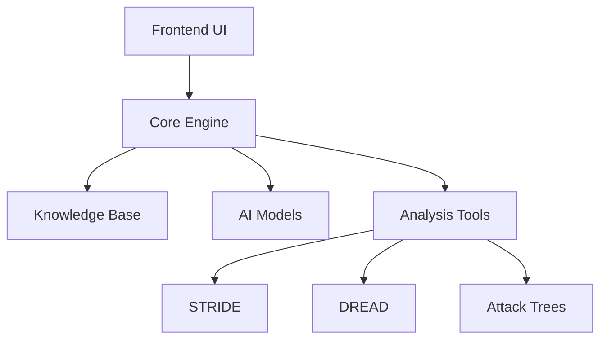
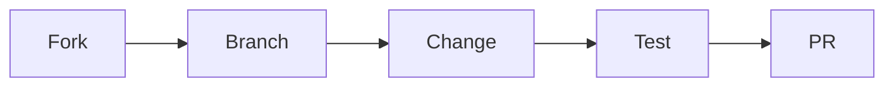

<div align="center">
  
# STRIDER 
### Adaptive STRIDE Threat Modeling System

[](https://opensource.org/licenses/MIT)
[](https://www.python.org/downloads/)
[](https://streamlit.io/)
[](https://github.com/psf/black)
[](https://github.com/yourusername/strider/graphs/commit-activity)
[](http://makeapullrequest.com)


[Features](#features) • [Installation](#installation) • [Documentation](#documentation) • [Contributing](#contributing) • [Support](#support)

---

</div>

## 🌟 Overview

<table>
<tr>
<td>

**STRIDER** revolutionizes threat modeling by combining cutting-edge AI with the proven STRIDE methodology. It empowers engineering teams to:

- 🎯 Automate security analysis with multi-model AI
- 🔍 Identify potential threats early in development
- 📊 Visualize security landscapes through interactive diagrams
- 🛠️ Generate actionable mitigation strategies

</td>
</tr>
</table>

## Proposed Architecture:
In Development based on below architecture:
[![Diagram](https://mermaid.ink/img/pako:eNqdV-9vmzgY_lcsplU9ifUChqTNh5PaZLtGTZS0SXvSkX5wjElQic0wdJct-9_vNWACJJW6Ubkifh_7_f3Y_DCo8JnRN4JIfKMbkqRoMVxyBI_MVuuExBv0OPKWxqNkCRrxlCUBoQyNyY4lS-O5gKrHDxNG01BwNH44zD6OLO8ftjqsfEafPv2F9o9xJIj_54jHWboHlO3lr-iJRKFPUpE81_ewi0WlkPloSFKilmFvloh1wqREi4TQF9Zch4t185SkmUSPsVos1TrHe2Ayi1IJO8nNSpDELxcy7i95KwCjGQSgsA_UUdAW8vW7QzCaWd5AbGPBGU_RNSfR7nvDztHM9pRD6AvkAE1IHLfE2FskmUzRjci4T5IdGrIUFIkmyvEWjG4QOEtf2mpOeXV3A17dcfEtYv6aoRsi35_WuxvLW2wSRiAiJIXUcojkzXMdYHu3oQQbQ0qiPF8NKa6FZMG2caQy00A43pzRLAnTHXrIokp4ypP7OXhyn4Xg95wS_m4v7ueWN188jIaf0QD0rwWE9kR-7uc2lEvEXgmHyp9TkbTEqgpDkZuqMpNsQ94q4ft5XnEiS2CH6ygStAY45dLwGlwaMhYXBslQvturao_bGaRgvUHauNpK9dxCXWI0Hk_QBCggkkdi2_uSRREaCC4Zl1kdkJusf5xQPZl5E-aH2fYt5RNQbr-tfALKZ0BGIfk9_eOZN4ZeekP5GJRbB-VHUtuDZgipJiMI8CnVp9I2eIK0DRIBfHRY_O7MDZ4s7zrN-3ewISE_VYyDJyALFoNyxukOcKzFeoMn7I22MaHANVICV4mm1PHKjj3i2lMOTRX1TbP0N7lvOqt4QqVRHJP7FKINoiBU_pzorums1l0PhL-0pKqvYgHH1t-Ms-S0Nx8_AqtCOA8kCxp5Ya4sIOUZs7-O4wgYK3ekOGSAvgsIvBTHyYG5RjwQCmFrRHlQaSJXMqxl5WFUkbhe7GiAUwByFtddv1ckVfOjxddHfgAxF7voJE9ISjflLiUxF4AWOyuIrSFYW1IScy0KQMzlodpg572qrJqdNTZWwSjmwYgygg22Ld20Nag0sEW5OQZrTGlhVRlj9gosoiCOhuR27hsMuFek15S3aGqvmKmJqBPJXnFHzc0mQx88vdW1khMMKi8bSn3p5eQNwEQDxm8AxgqgldjoTK2A_-PZ0R2p6Ls8M3WTj9jpYDUAi03qJJRvYGtAqaVioLBIPdbyMi-agKr05tVRElDb0Mq3aSO2x6xzsHR66EXNKnWPpzqKUx2WvIQaCKwRpck5tzQQjkaUFn-BY11lQtFNfomsF4Kilnmq6rSYG8IN6bykvuHNH8961vbOq6tnbRp759eZH6ZoLNaloLH36s1uP8tb-izv2rOqPUF903rQfGC6s7y4z2pCrPXRiEg5ZAHKQhSEUdT_wHBgB74p00S8sP4Hy-26tNMCh3EJDjBzA7cC91ZWQOwW-GWlwQHAOxWYBV3aae_8VWozLgOXXVVgm_V83N7ZJ3pnyhxGKzC1rUt31QLT118wQ8S_EA2_ctAN6tHoWuqvEWn1gWRCSmBgGA6EvS4F2jXhVIGBTXVAhHFdCuk3IfkwsKkS_1J3UbGtCWQKA5sq3V9lXQoMZQKBmEBEMGwT-MZUJOKTOgoYwYSmh4FN1bn0tS6FLjShw2BgU5WSaFgHJWhC1cHAEBHDNLZwMyahDx-bPxRuaaQbtmVLow-vPgsINMXSWPKfACVZKuY7To1-mmTMNLL8020YEriVbI1-QCJZzX6GthFJNRkT_q8QW70Sfhr9H8Z_Rt_p9C5wz3avOk6na_fsS9PYGX0LX1h278p2ujbuYMft2D9N43u-Qefiqtu7dC2353YuLRd3e6bBcmWT4puZqnvLGsxNRLbelBb8_B_cwp-7?type=png)](https://mermaid.live/edit#pako:eNqdV-9vmzgY_lcsplU9ifUChqTNh5PaZLtGTZS0SXvSkX5wjElQic0wdJct-9_vNWACJJW6Ubkifh_7_f3Y_DCo8JnRN4JIfKMbkqRoMVxyBI_MVuuExBv0OPKWxqNkCRrxlCUBoQyNyY4lS-O5gKrHDxNG01BwNH44zD6OLO8ftjqsfEafPv2F9o9xJIj_54jHWboHlO3lr-iJRKFPUpE81_ewi0WlkPloSFKilmFvloh1wqREi4TQF9Zch4t185SkmUSPsVos1TrHe2Ayi1IJO8nNSpDELxcy7i95KwCjGQSgsA_UUdAW8vW7QzCaWd5AbGPBGU_RNSfR7nvDztHM9pRD6AvkAE1IHLfE2FskmUzRjci4T5IdGrIUFIkmyvEWjG4QOEtf2mpOeXV3A17dcfEtYv6aoRsi35_WuxvLW2wSRiAiJIXUcojkzXMdYHu3oQQbQ0qiPF8NKa6FZMG2caQy00A43pzRLAnTHXrIokp4ypP7OXhyn4Xg95wS_m4v7ueWN188jIaf0QD0rwWE9kR-7uc2lEvEXgmHyp9TkbTEqgpDkZuqMpNsQ94q4ft5XnEiS2CH6ygStAY45dLwGlwaMhYXBslQvturao_bGaRgvUHauNpK9dxCXWI0Hk_QBCggkkdi2_uSRREaCC4Zl1kdkJusf5xQPZl5E-aH2fYt5RNQbr-tfALKZ0BGIfk9_eOZN4ZeekP5GJRbB-VHUtuDZgipJiMI8CnVp9I2eIK0DRIBfHRY_O7MDZ4s7zrN-3ewISE_VYyDJyALFoNyxukOcKzFeoMn7I22MaHANVICV4mm1PHKjj3i2lMOTRX1TbP0N7lvOqt4QqVRHJP7FKINoiBU_pzorums1l0PhL-0pKqvYgHH1t-Ms-S0Nx8_AqtCOA8kCxp5Ya4sIOUZs7-O4wgYK3ekOGSAvgsIvBTHyYG5RjwQCmFrRHlQaSJXMqxl5WFUkbhe7GiAUwByFtddv1ckVfOjxddHfgAxF7voJE9ISjflLiUxF4AWOyuIrSFYW1IScy0KQMzlodpg572qrJqdNTZWwSjmwYgygg22Ld20Nag0sEW5OQZrTGlhVRlj9gosoiCOhuR27hsMuFek15S3aGqvmKmJqBPJXnFHzc0mQx88vdW1khMMKi8bSn3p5eQNwEQDxm8AxgqgldjoTK2A_-PZ0R2p6Ls8M3WTj9jpYDUAi03qJJRvYGtAqaVioLBIPdbyMi-agKr05tVRElDb0Mq3aSO2x6xzsHR66EXNKnWPpzqKUx2WvIQaCKwRpck5tzQQjkaUFn-BY11lQtFNfomsF4Kilnmq6rSYG8IN6bykvuHNH8961vbOq6tnbRp759eZH6ZoLNaloLH36s1uP8tb-izv2rOqPUF903rQfGC6s7y4z2pCrPXRiEg5ZAHKQhSEUdT_wHBgB74p00S8sP4Hy-26tNMCh3EJDjBzA7cC91ZWQOwW-GWlwQHAOxWYBV3aae_8VWozLgOXXVVgm_V83N7ZJ3pnyhxGKzC1rUt31QLT118wQ8S_EA2_ctAN6tHoWuqvEWn1gWRCSmBgGA6EvS4F2jXhVIGBTXVAhHFdCuk3IfkwsKkS_1J3UbGtCWQKA5sq3V9lXQoMZQKBmEBEMGwT-MZUJOKTOgoYwYSmh4FN1bn0tS6FLjShw2BgU5WSaFgHJWhC1cHAEBHDNLZwMyahDx-bPxRuaaQbtmVLow-vPgsINMXSWPKfACVZKuY7To1-mmTMNLL8020YEriVbI1-QCJZzX6GthFJNRkT_q8QW70Sfhr9H8Z_Rt_p9C5wz3avOk6na_fsS9PYGX0LX1h278p2ujbuYMft2D9N43u-Qefiqtu7dC2353YuLRd3e6bBcmWT4puZqnvLGsxNRLbelBb8_B_cwp-7)


## ⚡ Features

<div align="center">

| Core Features | Analysis Tools | Visualization | Integration |
|--------------|----------------|---------------|-------------|
| 🤖 Multi-Model AI | 📊 STRIDE Analysis | 🌳 Attack Trees | 🔌 Ollama Support |
| 🧠 Knowledge Base | 🎲 DREAD Assessment | 📈 Data Flow Diagrams | ☁️ OpenAI Integration |
| 🔄 Real-time Processing | ✅ Test Generation | 📱 Interactive UI | 💾 Local Database |
| 🏗️ Component Detection | 🔍 Deep Inspection | 📉 Risk Visualization | 📡 API Support |

</div>

## 🚀 Quick Start

### Prerequisites

<details>
<summary>Click to expand</summary>

```markdown
- Python 3.8+
- Ollama (for local models)
- OpenAI API key (optional)
- 8GB RAM minimum
- 100GB disk space
```
</details>

### 🔧 Installation

```bash
# Clone with depth 1
git clone --depth 1 https://github.com/AI-Security-Research-Group/strider.git

# Setup virtual environment
python -m venv .venv
source .venv/bin/activate  # Linux/Mac
# or
.\.venv\Scripts\activate   # Windows

# Install with progress
pip install -r requirements.txt --progress-bar on
```

### 🎮 Usage

```python
# Start STRIDER
streamlit run main.py

# Access at http://localhost:8501
```

## 🏗️ Architecture



## 🤝 Contributing

We welcome contributions! Here's how you can help:



<table>
<tr>
<td>

1. 🍴 Fork the repository
2. 🌿 Create your feature branch
3. 💻 Add your changes
4. ✅ Ensure tests pass
5. 📝 Update documentation
6. 🚀 Submit PR

</td>
</tr>
</table>

## 📈 Project Status

<div align="center">

| Module | Status | Coverage |
|--------|--------|----------|
| Core Engine | ✅ Active | 40% |
| UI Components | ✅ Active | 88% |
| Documentation | 🚧 WIP | 75% |
| Knowledge Base | ✅ Active | 12% |

</div>


## 🙏 Support

<div align="center">

| Type | Channel |
|------|---------|
| 🐛 Bugs | [Issue Tracker](https://github.com/AI-Security-Research-Group/strider/issues) |

</div>

## 📜 License

<table>
<tr>
<td>

This project is licensed under the MIT License. See the [LICENSE](LICENSE) file for details.

```
MIT License
Copyright (c) 2024 STRIDER
```

</td>
</tr>
</table>

---

<div align="center">

Made with ❤️ by the AISRG Team
